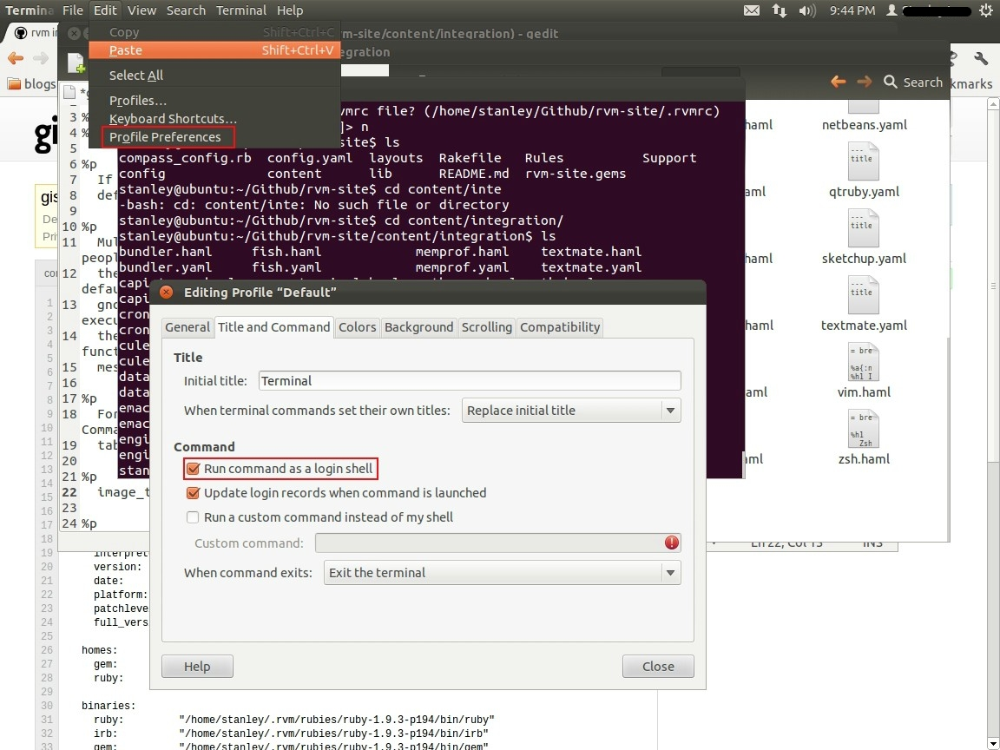

## Installing Ruby ##

###### Install curl ######
```
> sudo apt-get install curl
```

###### Install rvm (ruby version manager) ######
Note: rvm will e installed to the local user account, so don't use `sudo` or funky things might happen.
```
> gpg --keyserver hkp://keys.gnupg.net –recv-keys 409B6B1796C275462A1703113804BB82D39DC0E3

> curl -SSL https://get.rvm.io | bash -s stable
```

###### Integrate rvm with gnome-terminal ######
 Open the terminal, then from the menubar go to `Edit`=>`Profile Preferences`=>`Title and Command`=> check `Run command as a login shell`.

 


###### Restart the terminal ######
or type
```
> source ~/.rvm/scripts/rvm
```

###### Install ruby version ######
```
> rvm install 2.2.3
> rvm use 2.2.3 --default
```
