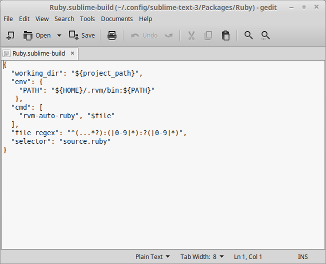

## Install Sublime Text ##

###### Fetch via package manager ######
```
> sudo apt-get install sublime-text
```

###### Install the package manager ######
copy-paste into the terminal

```
import urllib.request,os,hashlib; h = '2915d1851351e5ee549c20394736b442' + '8bc59f460fa1548d1514676163dafc88'; pf = 'Package Control.sublime-package'; ipp = sublime.installed_packages_path(); urllib.request.install_opener( urllib.request.build_opener( urllib.request.ProxyHandler()) ); by = urllib.request.urlopen( 'http://packagecontrol.io/' + pf.replace(' ', '%20')).read(); dh = hashlib.sha256(by).hexdigest(); print('Error validating download (got %s instead of %s), please try manual install' % (dh, h)) if dh != h else open(os.path.join( ipp, pf), 'wb' ).write(by)

```

###### Open package manger ######
```
Ctl + Shift + p
```

###### Install SublimeCodeIntel ######
```
> Package Control: Install Package
> SublimeCodeIntel
```

###### Navigate to the sublime-text packages ######
```
/home/matt/.config/sublime-text-3/Packages
```
Create a `Ruby` folder if one does not already exist. <br />
Create or edit a file named `Ruby.sublime-build`


